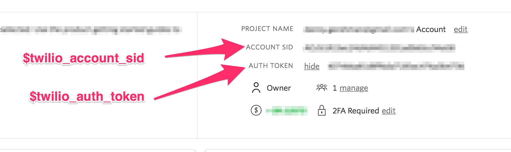

[](https://travis-ci.org/radius314/yap)
# yap

Requires a minimum of PHP 5.6 to use.

The purposes of yap are :
* To be able to take the results of a BMLT root server and play it back through the telephone.  
* To be able to set up routing rules for zip codes and helpline numbers with optional extension dialing.

Unlike it's predecessor bmlt-vox, this doesn't require any special infrastructure other than a server capable of delivering PHP over HTTP(S).

We are taking advantage of using Twilio which essentially handles all the VOIP parts.  You provision a number, set up an application, and point it your PHP server.

# Table of Contents

General

* [Setup](#setup)
* [Voice Recognition Optimizations](#voice-recognition-optimizations)
* [Configuration Precedence](#configuration-precedence)
* [State/Province Lookup](#state-province-lookup)
* [Tollfree Bias](#tollfree-bias)
* [Location Lookup Bias](#location-lookup-bias)
* [Language Options](#language-options)
* [Postal Code Lengths](#postal-code-lengths)
* [Fallback](#fallback)
* [Voice Greeting](#voice-greeting)

Meeting Search

* [Meeting Search Radius](#meeting-search-radius)
* [Results Counts Maximums](#results-counts-maximums)
* [Grace Period](#grace-period)
* [Ignoring Certain Formats](#ignoring-certain-formats)
* [Post Call Options](#post-call-options)
    * [Making SMS results for voice calls optional](#making-sms-results-for-voice-calls-optional)
    * [Infinite Searches](#infinite-searches)
* [SMS Gateway](#sms-gateway)
* [Adding Map Links](#adding-map-links)

Helpline/Volunteer Routing

* [Helpline Search Radius](#helpline-search-radius)
* [Using Hidden Service Bodies For Helpline Lookups](#using-hidden-service-bodies-for-helpline-lookups)
* [Using A Different BMLT Server for Helplines](#using-a-different-bmlt-server-for-routing)
* [Helpline Call Routing](#helpline-call-routing)
* [Checking Call Routing](#checking-call-routing)
* [Skipping Helpline Call Routing](#skipping-helpline-call-routing)
* [Force Helpline Routing](#force-helpline-routing)
* [Force Dialing](#force-dialing)
* [Volunteer Routing](#volunteer-routing)
* [Music On Hold](#music-on-hold)
* [Tomato Helpline Routing](#tomato-helpline-routing)

Miscellaneous
* [Playback for the Just For Today Meditation](#playback-for-the-just-for-today-meditation)
* [Upgrading](#upgrading)
* [Upgrading from Yap 1.x to 2.x](#upgrading-from-yap-1x-to-yap-2x)
* [Contribute](#contribute)
* [Call Flow](#call-flow)

# General

## Setup

Here is an instructional video that might assist you: https://www.dropbox.com/s/e59dzal4rkkcl2r/twilio.mp4?dl=0
**This will require that you have an SSL certificate installed on your webserver to transit a secure connection.  This is required by Twilio.**

1. Create a new virtual application or add the yap code to an existing folder.  The easiest way to get the code there is to upload the latest version there: https://github.com/radius314/yap/archive/2.1.2.zip.

2. Once the application is configured you will need to customize the config.php file.  There are several settings there that are documented in that file.  There are a number of different ways to utilize the yap platform. 

3. **NEW**>> You will need to (`config.php`) enter `$twilio_account_sid` and `$twilio_auth_token`.  You can find this on your account dashboard.  



4.  You will need to ensure that the following `config.php` parameters are set.  They should be a service body admin that will be responsible for reading and writing data back to your BMLT.  This will not work with the "Server Administrator" account.  The user should be at the highest level of access in your BMLT hierarchy that you require access to.
   
```php
static $bmlt_username = "";
static $bmlt_password = "";
```

5. Be sure to get a Google Maps API key.  Specify this in config.php as the value for `$google_maps_api_key`.  Make sure you have "Google Maps Geocoding API" enabled on your credentials.  If you have one already for your BMLT, you can use that as well (you don't need a separate one).  This article may be useful https://bmlt.magshare.net/google-maps-api-keys-and-geolocation-issues/.

6. Try testing that your application actually is functioning properly by opening a browser http://example.com/index.php.  

7. You will need to set up a Twilio account, and do the following:
    * Purchase a phone number (typically you would buy one for your locale, tollfree is pretty much unnecessary these days).
    * Configure that number to point to a Webook.  It would be something like https://example.com/index.php.

8. You can test whether or not you are properly configured by going to https://example.com/upgrade-advisor.php.

9. Make a call to your number and try it out.  If there is a problem the debugger in the Twilio console will let you know why.  Most likely you did not setup your config.php file correctly.

## Configuration Precedence

It's possible to override most of the settings in several different ways.  There is a sequence of precedence as follows.  You can always validate the setting by going to the settings in the admin portal.

1) Querystring parameters that match the name.  For example if you wanted to override the title for one page you'd do the following: `index.php?title=something+here`
2) Session overrides.  This means the entire call will use this setting.  `index.php?override_title=something+here`.  Twilio will respect this setting for entire during of the call.
3) Config.php.  Any setting is controllable from within config.php.
4) Factory defaults.  You can review them on your `/admin/settings.php` page.

## Voice Recognition Optimizations

It's possible to set the expected spoken language, for recognition by setting the following variable in config.php to the culture variant.  The default is `en-US`, which is US English.

Use the this chart to find the code of your preference https://www.twilio.com/docs/api/twiml/gather#languagetags.

```php
static $gather_language = "en-US";
```

You can also set some expected words or hints, to help the voice recognition engine along.  Use the setting by separating words with commas.  You can use phrases as well.  

Each hint may not be more than 100 characters (including spaces).  You can use up to 500 hints.

```php
static $gather_hints = "";
```

## State/Province Lookup

It may be that your instance needs to search multiple states.  By default searches will be biased towards the local number state (unless it's tollfree).  To enable province lookup set the `$province_lookup`, variable to `true` in the `config.php` file.  

## Tollfree Bias

Tollfree is independent of any state/province bias.  

To enable a specific bias, add `static $toll_free_province_bias` to your `config.php`, and set to the two letter state bias.  

Example `$toll_free_province_bias = "TX"`, will bias to Texas.

## Location Lookup Bias

By default location lookups are biased toward the US.  You can create a series of refinements by using the `$location_lookup_bias` in config.php.

For example say you wanted to lookup Bayonne.  By default Bayonne, New Jersey would be interpreted.  If you were intended for France you would set your config as the following:

```php
static $location_lookup_bias = "country:France";
```

A full listing of available bias options are available here: https://developers.google.com/maps/documentation/geocoding/intro#ComponentFiltering.  You can use as few or as many as you want, by separating each set with pipe "|" character.

## Language Options

There is a concept of language resource files.  You will notice them in the `lang/` folder.  Please open a ticket if you would like to contribute to translating to another language.

You can also override any of the language prompts in the `config.php` file. 

For example, say you wanted to still use English, but change the "city or county" prompt to say, "city or suburb".  You would do the following in config.php:

```php
static $override_city_or_county = "city or suburb";
```

You can see the full listing in the `lang/en-US.php` which always has the full latest listing of the voice prompts.

You can also change the spoken language accent.  There is a wide variety.  See the Twilio documentation for more details: https://www.twilio.com/docs/voice/twiml/say#attributes-language

An example would be using an Australian English Accent.  Set your config.php to:

```php
static $voice = "alice";
static $language = "en-AU";
``` 

You can also create a language selection menu upon dialing in.  It will only be available for those that there are resource files for in `lang/` folder.  If you have some translations, please send them, so they can be merged in.

Add a new setting called, specifying the language codes for each language you want included.  The order will indicate the order in which it will be played back:

```php
static $language_selections = "en-US,pig-latin";
```

This example will make option 1, English and option 2, pig latin.

## Postal Code Lengths

By default a 5 digit postal code will be asked for.  To override this set the following, for instance a 4 digit postal code:

```php
static $postal_code_length = 4;
```

## Fallback

There may be times when a root server is down, it's possible to redirect a call to another if this happens.  In your `config.php`, specify the following.

```php
static $helpline_fallback = "1919555555";
```

## Voice Greeting

It's possible to record a custom voice prompt and have it play back instead of the traditional voice engine.  Set the following:

*Keep in mind that this will override the main menu as well, so you should record the relevant prompts (i.e. press 1 to find someone to talk too... press 2 to find a meeting)

```php
static $en_US_greeting = "https://example.com/your-recorded-greeting.mp3"
```

You can also set a custom greeting for voicemail.

```php
static $en_US_voicemail_greeting = "https://example.com/your-recorded-greeting.mp3"
```

These settings are overridable from within each service body configuration.

# Meeting Search

## Meeting Search Radius

Change the default meeting search radius, this can be in miles or a negative number which would set the radius at the first n results. You can change this in your `config.php` with the following:

```php
static $meeting_search_radius = 30;
```
This would set the radius to a maximum of 30 miles.

```php
static $meeting_search_radius = -50;
```
This would set the radius at the first 50 results and is the default.

More information on how the BMLT uses search radius is here: https://bmlt.magshare.net/how-auto-radius-works/

## Results Counts Maximums

The default number of meeting results is 5.  You can change this in your `config.php` with the following:

```php
static $result_count_max = 10;
```

This would set to a maximum of ten (10) results.

## Grace Period

By default a 15 minute grace period will be applied.  This can be adjusted by setting `$grace_minutes` in your `config.php`.

## Ignoring Certain Formats

In some cases you might want to ignore a specific format.  Add the following setting with the formats you want to exclude.  Separate each with a comma.

```php
static $ignore_formats = "ASM";
```

## Post Call Options

### Making SMS results for voice calls optional

The default of the system is to send an SMS after each voice meeting result.  As an option to you audience you can add the following parameter to your `config.php` file.

```php
static $sms_ask = true;
```

By setting this, a prompt will be played at the end of the results, asking if they would like the results texted to them.  If they do not respond the call will automatically hang up in 10 seconds.

### Infinite Searches

You can provide an option to allow someone to search again.  Just set:

```php
static $infinite_searching = true;
``` 

## SMS Gateway

In order to use SMS to get a list of meetings you will configure Messaging to point to Webook sms-gateway.php.

Then you can send a zip code, county or city to your phone number and get back a response.

## Adding Map Links

Some older handsets are not capable of rendering maps links.  If you want to enable this feature add the following to your `config.php` file.

```php
static $include_map_link = true;
```

# Helpline / Volunteer Routing

## Helpline Search Radius

Change the default helpline search radius, this is in miles. You can change this in your `config.php` with the following:

```php
static $helpline_search_radius = 30;
```
This would set the radius to a maximum of 30 miles and is the default.

## Using Hidden Service Bodies For Helpline Lookups

It is possible to create a service body with an unpublished group in order create additional routing for service bodies that may not exist in a given root server.  

Once those service bodies have been populated and the unpublished meetings are added, you can make use of the helpline field to route calls.

You will also need to add to the config.php three additional variables.  This allows yap to authenticate to the root server and retrieve the unpublished meetings.  This is required as a BMLT root server by design will not return unpublished meetings in the semantic interface.

```php
static $helpline_search_unpublished = true;
static $bmlt_username = "";
static $bmlt_password = "";
```

You will need to also ensure that PHP has write access to write to this folder, in order to store the authentication cookie from the BMLT root server.

**NOTE: This will not work for the Tomato server, because there is no concept of authentication.**

## Using A Different BMLT server for routing

In order to specify a different BMLT root server for call routing but not for meeting list lookups, set the following variable in config.php.

```php
static $helpline_bmlt_root_server = "";
```

## Helpline Call Routing

The helpline router utilizes a BMLT server (2.9.0 or later), that has helpline numbers properly configured in the "Service Body Administration" section.  

A prompt will ask for a piece of location information in turn it will look up latitude and longitude and then send that information to the BMLT root server you have configured.

You can also tie this into an existing extension based system, say for example Grasshopper.  If you want to dial an extension just add something like `555-555-5555|wwww700` for example after the helpline field on the BMLT Service Body Administration.  In this case it's instructing to dial 555-555-5555 and wait 4 seconds and then dial 700. 

## Checking the call routing

There is a very simple way to check where a could would be routed to.

```shell
curl https://example.com/yap/helpline-search.php?Digits=Turkey,NC
```

## Skipping Helpline Call Routing

When configuring the TwiML app instead of pointing to `index.php` point to `input-method.php?Digits=2`.

If you still want the title to display also point to `input-method.php?Digits=2&PlayTitle=1`.

This could useful for wiring up to a Grasshopper extension.  Typically you set this as Department Extension and have your prompt instruct to press a series of keypresses.  

For example, if you set this up as extension 1, from within you employee extensions you would instruct the caller to press *1 (star one) for finding meetings.  

## Force Helpline Routing

You can force the helpline option to go directly to a specific service body by specifying the following on your webhook in Twilio.

`?override_service_body_id=x`

The service body id would be found in your BMLT root server.  It must exist in that root server instance to be routed correctly.

## Force Dialing

You might want to force a particular Twilio number to just call another number.  Just use the following webhook.

`/helpline-search.php?ForceNumber=8885551212` or for extension dialing `/helpline-search.php?ForceNumber=8885551212%7Cwwww700`.  Each `w` is a 1 second pause.

In some cases, when using 1 second pauses you may want to indicate that there is something happening to the end user as there will be a delay.

If you would like there to be a CAPTCHA to prevent robocalls + fax machines, you can add this to your query.

`&Captcha=1`

And/or, if you would like to have a basic waiting message, but no CAPTCHA use.

`&WaitingMessage=1`

These options can be combined.

## Volunteer Routing

Incompatible with Yap 1.x Volunteer Dialers, you will have reconfigure your setup.  

1) You will need to ensure that the following `config.php` parameters are set.  They should be a service body admin that will be responsible for reading and writing data back to your BMLT.  This will not work with the "Server Administrator" account.

```php
static $bmlt_username = "";
static $bmlt_password = "";
```

2) You will need to specify Twilio API parameters.  You can find this on your account dashboard when you login into Twilio.

```php
static $twilio_account_sid = "";
static $twilio_auth_token = "";
```

3) Head over to your admin login page.  https://your-yap-instance/admin.
4) Login with any credentials from your BMLT server.   
5) Go to the Service Bodies tab and click "Configure".  From there you should see a check box to enable Volunteer Routing.  Check it off and save.
6) Go to Volunteers, and you should see that service body in the dropdown, and select it.
7) Click Add Volunteer.  Fill out the Name field, and then click the "+" to expand out the rest of the details.  You should be able to start populating the number and shift information.  You will also have to click "Enable" in the bottom right.  Once you are done, click "Save Volunteers".
8) You can also sort the sequence by dragging and dropping the volunteer cards.
9) Go to Schedules to preview your changes.  Select your service body from the dropdown, and it should render onto the calendar.  
10) You can now test to see if things are working.

    * Volunteer Routing Redirect: You do this by setting in the Service Body Configuration the Volunteer Routing mechanism to "Volunteers Redirect" and specifying the respective Service Body Id in the "Volunteers Redirect Id" field. 
    * Forced Caller Id: This setting changes the outgoing display caller id.
    * Call Timeout: This is the number of seconds before trying the next number for volunteer routing.

## Voicemail

This is configured through service body configuration, through your call strategy setting.  If you specify a Primary Contact Number, it will SMS a link to that person when a voicemail is left.

Voicemail links are also available in the Twilio Console under "Recordings".  

You can also optionally use email.  You will have to enable this by adding an email address under the Primary Contact Email.

You will also need to ensure that the following settings are in your `config.php`.

```php
static $smtp_host = '';             // the smtp server
static $smtp_username = '';         // the smtp username
static $smtp_password = '';         // the smtp password
static $smtp_secure = '';           // either ssl (port 486) or more securely tls (port 587)
static $smtp_from_address = '';     // the address where the email will be sent from
static $smtp_from_name = '';        // the label name on the from address
```

If you need to, for some reason, to override the port here is another optional setting.

```php
static $smtp_alt_port = '';         // enter the integer for the respective to use
```

If you do not receive an email, check your server logs.  There should be some good information there.  Also the upgrade advisor should give you some information about what might be missing as long as $smtp_host is set.

## Music On Hold

Music on hold will play when doing volunteer routing which is configurable from within the service body configuration.  You can specify one or more URLs to an MP3 file or Shoutcast stream.  Separate them by commas.

There are also some free alternatives.  They are licensed by Creative Commons.  They are playlists themselves so they may not be combined with any other URLs. 

* Ambient: https://twimlets.com/holdmusic?Bucket=com.twilio.music.ambient - [[license]](http://com.twilio.music.ambient.s3.amazonaws.com/license.txt)
* Classical (default): https://twimlets.com/holdmusic?Bucket=com.twilio.music.classical - [[license]](http://com.twilio.music.classical.s3.amazonaws.com/license.txt)
* Electronica: https://twimlets.com/holdmusic?Bucket=com.twilio.music.electronica - [[license]](http://com.twilio.music.electronica.s3.amazonaws.com/license.txt)
* Guitars: https://twimlets.com/holdmusic?Bucket=com.twilio.music.guitars - [[license]](http://com.twilio.music.guitars.s3.amazonaws.com/license.txt)
* New Age: https://twimlets.com/holdmusic?Bucket=com.twilio.music.newage - [[license]](http://com.twilio.music.newage.s3.amazonaws.com/license.txt)
* Rock: https://twimlets.com/holdmusic?Bucket=com.twilio.music.rock - [[license]](http://com.twilio.music.rock.s3.amazonaws.com/license.txt)
* Soft Rock: https://twimlets.com/holdmusic?Bucket=com.twilio.music.soft-rock - [[license]](http://com.twilio.music.soft-rock.s3.amazonaws.com/license.txt)

Music on Hold loops indefinitely.

## Tomato Helpline Routing

In some cases you might want make use of aggregated helpline information.  This might be a bit nuanced, but it exists.  

One thing to note about this setting, is that Tomato is not able to get service body configuration, so it will be limited to helpline field routing only.

You can use this in your config.php, however keep in mind that this would break your admin portal.  Typically this would be used with a webhook as such.

`override_tomato_helpline_routing=true`

# Miscellaneous

## Playback for the Just For Today Meditation
This will add an option on the main menu to press 3 to playback the Just For Today meditation.

```php
static $jft_option = true;
```

## Upgrading

Make a new folder with the newer version and copy over the config.php.  Once you feel comfortable you can delete the older folder and rename it.

You can also run `make upgrade`, if you have shell access.

## Upgrading from Yap 1.x to Yap 2.x

Follow the upgrade steps as you normally do above.  You will also need to follow item #3 & #4 under [Setup](#setup), to add the Twilio credentials.

You can check that everything is functioning by going to the upgrade advisor http://your-instance/upgrade-advisor.php

## Contribute

Fork this repo and send a pull request.  For testing locally, run the yap server and then use `ngrok`.  Grab the ngrok hostname that is generated and then use that in your Twilio settings.

You get an instant proxy to your local services to step through and debug.

## Connectors

Yap has an API, and so there are other ways to pull out Yap information.

* [Facebook Messenger Bot](https://github.com/radius314/yap-fbmessenger-bot)

## Call Flow


