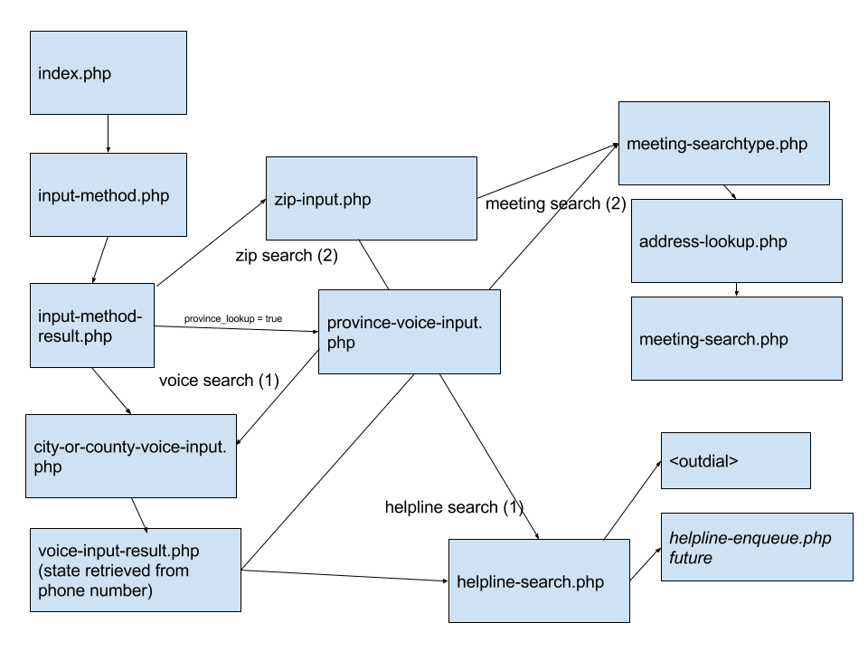

[](https://waffle.io/radius314/yap?utm_source=badge)
# yap

The purposes of yap are :
* To be able to take the results of a BMLT root server and play it back through the telephone.  
* To be able to set up routing rules for zip codes and helpline numbers with optional extension dialing.

Unlike it's predecessor bmlt-vox, this doesn't require any special infrastructure other than a server capable of delivering PHP over HTTP(S).

We are taking advantage of using Twilio which essentially handles all the VOIP parts.  You provision a number, set up an application, and point it your PHP server.

## Setup 

Here is an instructional video that might assist you: https://www.dropbox.com/s/e59dzal4rkkcl2r/twilio.mp4?dl=0

**This will require that you have an SSL certificate installed on your webserver to transit a secure connection.  This is required by Twilio.**

1. Create a new virtual application or add the yap code to an existing folder.  The easiest way to get the code there is to upload the latest version there: https://github.com/radius314/yap/archive/1.2.1.zip.

2. Once the application is configured you will need to customize the config.php file.  There are several settings there that are documented in that file.  There are a number of different ways to utilize the yap platform.  

3. Be sure to get a Google Maps API key.  Specify this in config.php as the value for `$google_maps_api_key`.  Make sure you have "Google Maps Geocoding API" enabled on your credentials.  If you have one already for your BMLT, you can use that as well (you don't need a separate one).  This article may be useful https://bmlt.magshare.net/google-maps-api-keys-and-geolocation-issues/.

4. Try testing that your application actually is functioning properly by opening a browser http://example.com/index.php.  

5. You will need to set up a Twilio account, and do the following:
* Purchase a phone number (typically you would buy one for your locale, tollfree is pretty much unnecessary these days).
* Configure that number to point to a Webook.  It would be something like http://example.com/index.php.
* Ensure that you are using HTTP GET and not HTTP POST.

6. Make a call to your number and try it out.  If there is a problem the debugger in the Twilio console will let you know why.  Most likely you did not setup your config.php file correctly.

## Results Counts Maximums ##

The default number of meeting results is 5.  You can change this in your `config.php` with the following:

```php
static $result_count_max = 10;
```

This would set to a maximum of ten (10) results.

## Meeting Search Radius ##

Change the default meeting search radius, this can be in miles or a negative number which would set the radius at the first n results. You can change this in your `config.php` with the following:

```php
static $meeting_search_radius = 30;
```
This would set the radius to a maximum of 30 miles.

```php
static $meeting_search_radius = -50;
```
This would set the radius at the first 50 results and is the default.

## Location Lookup Bias ##

By default location lookups are biased toward the US.  You can create a series of refinements by using the `$location_lookup_bias` in config.php.

For example say you wanted to lookup Bayonne.  By default Bayonne, New Jersey would be interpreted.  If you were intended for France you would set your config as the following:

```php
static $location_lookup_bias = "county:France";
```

A full listing of available bias options are available here: https://developers.google.com/maps/documentation/geocoding/intro#ComponentFiltering.  You can use as few or as many as you want, by separating each set with pipe "|" character.

## Language Options ##

There is a concept of language resource files.  You will notice them in the `lang/` folder.  Please open a ticket if you would like to contribute to translating to another language.

You can also override any of the language prompts in the `config.php` file. 

For example, say you wanted to still use English, but change the "city or county" prompt to say, "city or suburb".  You would do the following in config.php:

```php
static $override_city_or_county = "city or suburb";
```

You can see the full listing in the `lang/en-US.php` which always has the full latest listing of the voice prompts.

You can also change the spoken language accent.  There is a wide variety.  See the Twilio documentation for more details: https://www.twilio.com/docs/voice/twiml/say#attributes-language

An example would be using an Australian English Accent.  Set your config.php to:

```php
static $voice = "alice";
static $language = "en-AU";
``` 

## Postal Code Lengths ##

By default a 5 digit postal code will be asked for.  To override this set the following, for instance a 4 digit postal code:

```php
static $postal_code_length = 4;
```

## Ignoring Certain Formats ##

In some cases you might want to ignore a specific format.  Add the following setting with the formats you want to exclude.  Separate each with a comma.

```php
static $ignore_formats = "ASM";
```

## Voice Recognition Optimizations ##

It's possible to set the expected spoken language, for recognition by setting the following variable in config.php to the culture variant.  The default is `en-US`, which is US English.

Use the this chart to find the code of your preference https://www.twilio.com/docs/api/twiml/gather#languagetags.

```php
static $gather_language = "en-US";
```

You can also set some expected words or hints, to help the voice recognition engine along.  Use the setting by separating words with commas.  You can use phrases as well.  

Each hint may not be more than 100 characters (including spaces).  You can use up to 500 hints.

```php
static $gather_hints = "";
```

### Grace Period

By default a 15 minute grace period will be applied.  This can be adjusted by setting `$grace_minutes` in your `config.php`.

## Helpline Call Routing

The helpline router utilizes a BMLT server (2.9.0 or later), that has helpline numbers properly configured in the "Service Body Administration" section.  

The yap platform will ask for a piece of location information in turn it will look up latitude and longitude and then send that information to the BMLT root server you have configured.

You can also tie this into an existing extension based system, say for example Grasshopper.  If you want to dial an extension just add something like `555-555-5555|wwww700` for example after the helpline field on the BMLT Service Body Administration.  In this case it's instructing to dial 555-555-5555 and wait 4 seconds and then dial 700. 

## Skipping Helpline Call Routing

When configuring the TwiML app instead of pointing to `index.php` point to `input-method.php?Digits=2`.

If you still want the title to display also point to `input-method.php?Digits=2&PlayTitle=1`.

This could useful for wiring up to a Grasshopper extension.  Typically you set this as Department Extension and have your prompt instruct to press a series of keypresses.  

For example, if you set this up as extension 1, from within you employee extensions you would instruct the caller to press *1 (star one) for finding meetings.  

## Helpline Search Radius ##

Change the default helpline search radius, this is in miles. You can change this in your `config.php` with the following:

```php
static $helpline_search_radius = 30;
```
This would set the radius to a maximum of 30 miles and is the default.

## Including province prior to lookup

It may be that your yap instance needs to search multiple states.  By default yap will be biased towards the local number state (unless it's tollfree).  To enable province lookup set the `$province_lookup`, variable to `true` in the `config.php` file.  

## Tollfree bias

Tollfree is independent of any state/province bias.  

To enable a specific bias, add `static $toll_free_province_bias` to your `config.php`, and set to the two letter state bias.  

Example `$toll_free_province_bias = "TX"`, will bias to Texas.

## Using hidden service bodies

It is possible to create a service body with an unpublished group in order create additional routing for service bodies that may not exist in a given root server.  

Once those service bodies have been populated and the unpublished meetings are added, you can make use of the helpline field to route calls.

You will also need to add to the config.php three additional variables.  This allows yap to authenticate to the root server and retrieve the unpublished meetings.  This is required as a BMLT root server by design will not return unpublished meetings in the semantic interface.

```php
static $helpline_search_unpublished = true;
static $bmlt_username = "";
static $bmlt_password = "";
```

If for some reason this doesn't work, there is an alternative authentication method that seems to work for non-SSL connections `static $alt_auth_method = true`.

You will need to also ensure that PHP has write access to write to this folder, in order to store the authentication cookie from the BMLT root server.

**NOTE: This will not work for a sandwich server, because there is currently no concept of authentication.**

## Using as a separate BMLT server for call routing

In order to specify a different BMLT root server for call routing but not for meeting list lookups, set the following variable in config.php.

```php
static $helpline_bmlt_root_server = "";
```

## To upgrade easy ##

You will need `make`.  Once you have that, run `make upgrade`.

## Checking the call routing

There is a very simple way to check where a could would be routed to.

```shell
curl https://example.com/yap/helpline-search.php?Digits=Turkey,NC
```

## Post Call Options

### Making SMS results for voice calls optional

The default of the system is to send an SMS after each voice meeting result.  As an option to you audience you can add the following parameter to your `config.php` file.

```php
static $sms_ask = true;
```

By setting this, a prompt will be played at the end of the results, asking if they would like the results texted to them.  If they do not respond the call will automatically hang up in 10 seconds.

### Infinite Searches

You can provide an option to allow someone to search again.  Just set:

```php
static $infinite_searching = true;
``` 

## SMS Gateway

In order to use SMS to get a list of meetings you will configure Messaging to point to Webook sms-gateway.php.  Ensure that it's using HTTP GET.

Then you can send a zip code, county or city to your phone number and get back a response.

## Adding Map Links

Some older handsets are not capable of rendering maps links.  If you want to enable this feature add the following to your `config.php` file.

```php
static $include_map_link = true;
```

## Fallback

There may be times when a root server is down, it's possible to redirect a call to another if this happens.  In your `config.php`, specify the following.

```php
static $helpline_fallback = "1919555555";
```

## Volunteer Dialer (Beta)

You can also supply a list of volunteers in a BMLT server.  

1) Create a new format called "HV"
2) In the service body under the helpline specify "yap".
3) Make a new meeting (do not publish it).
4) For the meeting name use the volunteer's name.
5) Select the appropriate service body in the dropdown.  (Note: this service body must be set to "yap" as the helpline in Step #2)
6) Set the Start Time and Duration which will determine the length of the shift (this will recur every day unless you create additional volunteer entries that match the name)
7) Set the Location, this is currently used to specify what timezone the volunteer is in (in the future it may help with more succinct locating).
8) Select "HV" as the format.
9) Under the phone 1 field, enter this persons phone number.
10) Since this will be querying unpublished values you must set in `config.php` the BMLT server credentials.
   
```php 
   static $bmlt_username = "";
   static $bmlt_password = "";
```

Some additional details on this:

- You can visualize the shift schedule by going to http://example.com/yap/schedule.html and selecting from the dropdown.
- If you want to have a volunteer that always is on, then set the start time to "Midnight" and the Duration "Open-Ended"
- You can control the sequence by specifying "Location".  This will be sorted numerically ascending.  (for example 0 is the highest, 99 is the lowest)
- You can control the timeout between calls, which is defaulted at 20 seconds.  You do this by setting in config.php the following parameter.

```php
    static $call_timeout = 20;
```

## Facebook Messenger Gateway (Meetings Lookup)

**Your Yap server will have to have HTTPS/SSL enabled.  You will also need redis running locally.**

1) Create a new app under your Facebook developer account https://developers.facebook.com/apps/.  Whatever you name it will be the name of your bot.  (Example: North Carolina Region of NA)
2) Select "Messenger" as application product
3) You will need to link your bot to a page.  Either use an existing one or make a new one.  It may make sense to your service bodies one (not your personal one).
4) A token will be generated which you will need to add to config.php as the following:

```php
static $fbmessenger_accesstoken = '';
```

5) The verify token is an arbitrary secret which you use to verify that the request is coming from Facebook.  It prevents someone from hijacking your endpoint and flooding with messages.  Set the value you pick to the value in config.php:

```php
static $fbmessenger_verifytoken = '';
```

6) Add a new webhook.
7) The callback URL will be your Yap server pointing to the file `fbmessenger-gateway.php`.
8) Select "messages" and "messaging_postbacks" under subscription fields.
9) Once you've created your webhook, assign it to the page you created.
10) Call `http://your-yap-server/fbmessenger-activate.php` to activate yap connection to Facebook.
11) By default you will be in development mode and you should be able to search for the bot under your messenger on your personal account.  Once you are satisfied you can turn on the bot, which will allow other people to find it.
12) When are ready to go out of development mode, you will need to set a Privacy Policy under Basic Settings.  You will also have to set a Category.
13) You will need to submit your app to Facebook for review.  This requires setting a logo, as well as some same submissions that they the Facebook team can test with.  It may take up to 5 days for the review to pass.

Note: If you decide to change the `$title` in your config.php, you will have to force a refresh on your Facebook Messenger settings by calling `http://your-yap-server/fbmessenger-activate.php` again.  After this is done, it may take some time for Facebook to show these changes.

## Contribute

Fork this repo and send a pull request.  For testing locally, run the yap server and then use `ngrok`.  Grab the ngrok hostname that is generated and then use that in your Twilio settings.

You get an instant proxy to your local services to step through and debug.

## Call Flow


