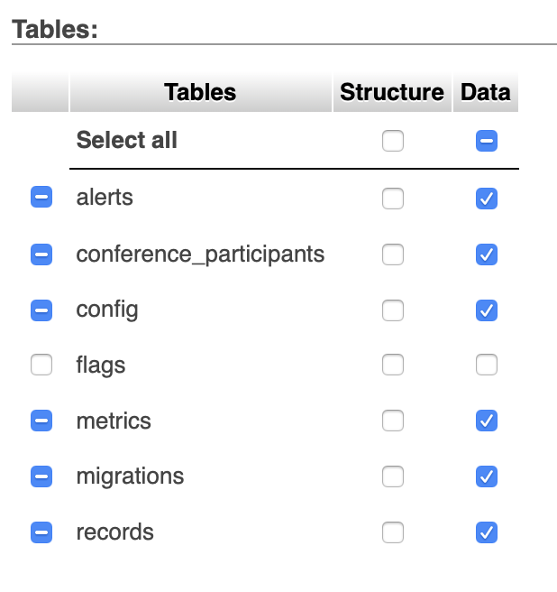

# Merging a Regional Yap Server into a Zonal Yap Server

Since Yap 3.0.0 (released in March 2019), it’s been possible to use a single Yap server with multiple Twilio accounts.  What this means is that a service body can handle the overhead of server management while another service body retains the management of phone numbers and billing.

<!--truncate-->

Yap 3 also introduced the concept of configuration precedence [https://github.com/bmlt-enabled/yap/wiki/Configuration-Precedence](https://github.com/bmlt-enabled/yap/wiki/Configuration-Precedence).  This creates the ability to manifest all kinds of powerful capability without requiring access to the config.php on the server (critical for this situation where server management is handled by someone else).  It also has the ability to set a value at regional level while the hierarchy of the BMLT automatically cascades down to the member areas.

Recently I had to migrate my regional yap server to the zonal server.  Below is the process I followed, feel free to send an email to [help@bmlt.app](mailto:help@bmlt.app) if you’d like more details.

Consider whether you may want to take a backup and overwrite your existing Yap database, or make a copy with a new install and config to do side by side testing.  You may also want to consider setting in the database config ahead of time or afterward.  You may also want to transfer any other settings in your top level config.php to the Config settings in the admin portal.  Keep in mind that service bodies will use the hierarchy, so if you set this as a regional level all the service bodies connected will inherit them.

1) Delete any configuration from the target yap server, use the server body IDs that would be the IDs that would be the query below:

```sql
DELETE FROM config where service_body_id in (x [,x]);
```

2) Begin an export from your source yap server, select only data and exclude the flags table.  See the screenshot below.  (Use a self-contained file)



3) After the file has been exported run the below on your system.  In the below example, “export.sql” is the file exported from Step 2 above.

```bash
cat export.sql | sed -e “s/([0-9]*,/(NULL,/g” > export-mod.sql
```

4) Import export-mod.sql into the target yap server.  “export-mod.sql” is the output from the command run locally in Step 3 above.

5) Your phone numbers must have explicit service body overrides in order to pull configuration values from the database (you can use either override_service_body_id or override_service_body_config_id).  One changes your service body for call routing and the other selects configuration, respectively.

